

<h1 align="center">Maxim Werkhowski</h1>
Creative problem solver with 24 years of experience in software development and design.  
enior Web Developer at one of Germanys top 10 most creative digital  agencies for 10 years.  
4 years as Full-Stack WebDev Lecturer.  
Developed AI applications for translation, user management and conversational knowledge retrieval

I'm driven to integrate all capabilities available today into software. My focus is value for the user. I'm able to design and operate applications within a very tight budget.  
  
Currently my focus is automation, including AI.

## Selected Projects

<h3 align="center">Company Knowledge AI Chat Bot (RAG)</h3>

|                                                |  `OpenAI`  `Node.js`  `Pinecone` |
|:---------------------------------------------------------|:------------------------------------------:|
| AI powered conversational interface to the company knowledge base. Slack integration. Real-time synchronization with Confluence.    **Idea, Development, Deployment Pipeline**  | 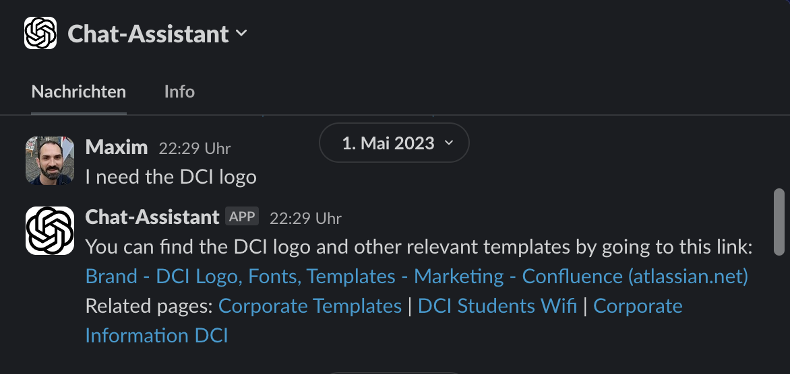 |

<h3 align="center">Student Support AI Chat Bot (RAG)</h3>

|                                                |  `OpenAI`  `Azure`  `Python`  `AWS`  `Weaviate`  `moodle` |
|:---------------------------------------------------------|:------------------------------------------:|
| AI powered conversational interface to student support knowledge base. moodle integration. Real-time synchronization with Confluence.    **UI Design, Architectural Design, Project Lead**  | 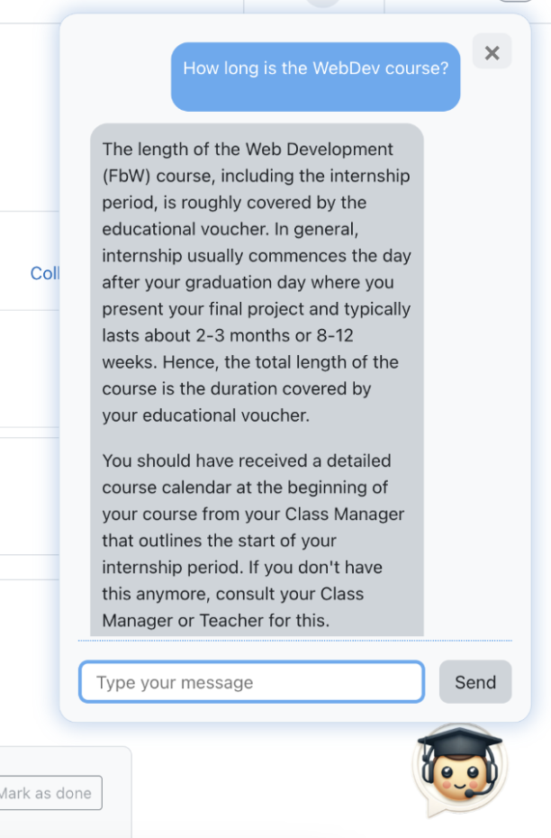 |

<h3 align="center">RIMOWA Website</h3>

|                                                |   `CSS3`  `HTML5`  `JavaScript` |
|:---------------------------------------------------------|:------------------------------------------:|
| Product and Shop UI and Frontend functionality as well as custom dynamic video panorama teaser    **Technical concept, research, development**  | 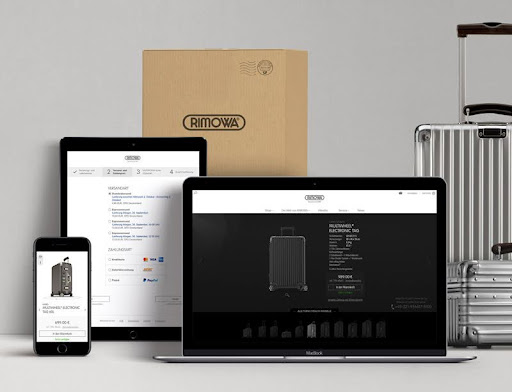 |

<h3 align="center">Curriculum CMS</h3>

|                                                |  `Decap`  `Golang`  `git-gateway`  `gotrue`  `Google Oauth`  `Caddy` |
|:---------------------------------------------------------|:------------------------------------------:|
| Custom CMS for universal curriculum management    **Architectural Design, Project Lead**  | 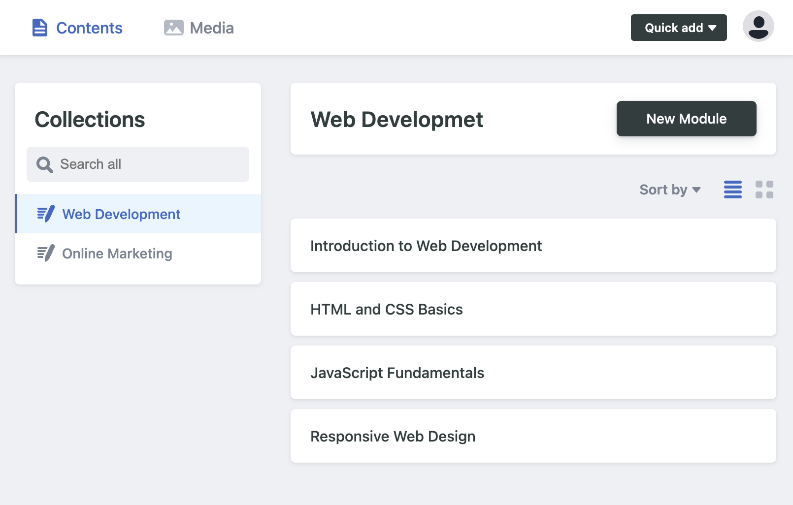 |

<h3 align="center">AI-assisted onboarding</h3>

|                                                |  `OpenAI`  `Node.js`  `GitHub CI`  `make` |
|:---------------------------------------------------------|:------------------------------------------:|
| AI assisted fully automated student onboarding pipeline    **Idea, Development, Deployment**  | 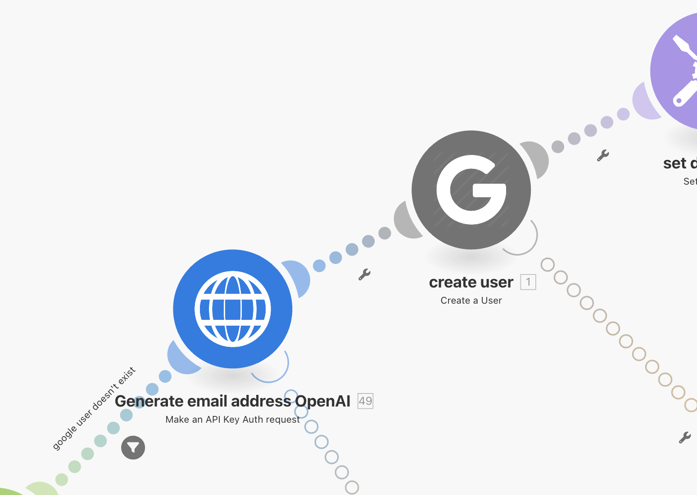 |

<h3 align="center">AI translation and review</h3>

|                                                |  `OpenAI`  `Node.js`  `GitHub API`  `GitHub App` |
|:---------------------------------------------------------|:------------------------------------------:|
| GitHub app for AI powered fully automated translation and workflow management    **Idea, Development, Deployment**  | 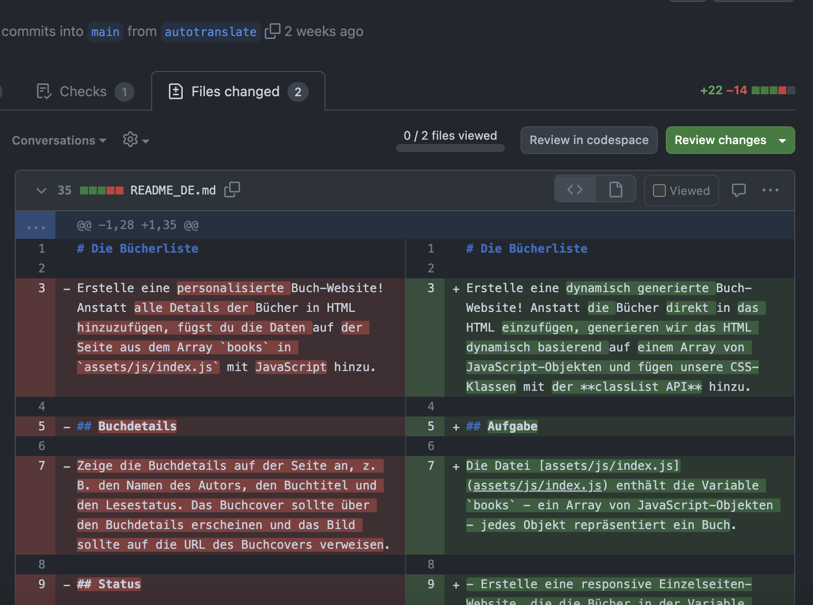 |

<h3 align="center">Automated Course Planner</h3>

|                                                |  `CSS3`  `HTML5`  `JavaScript`  `NES.css` |
|:---------------------------------------------------------|:------------------------------------------:|
| Application for automatic full course schedule generation and publishing    **Idea, Development, Deployment**  | 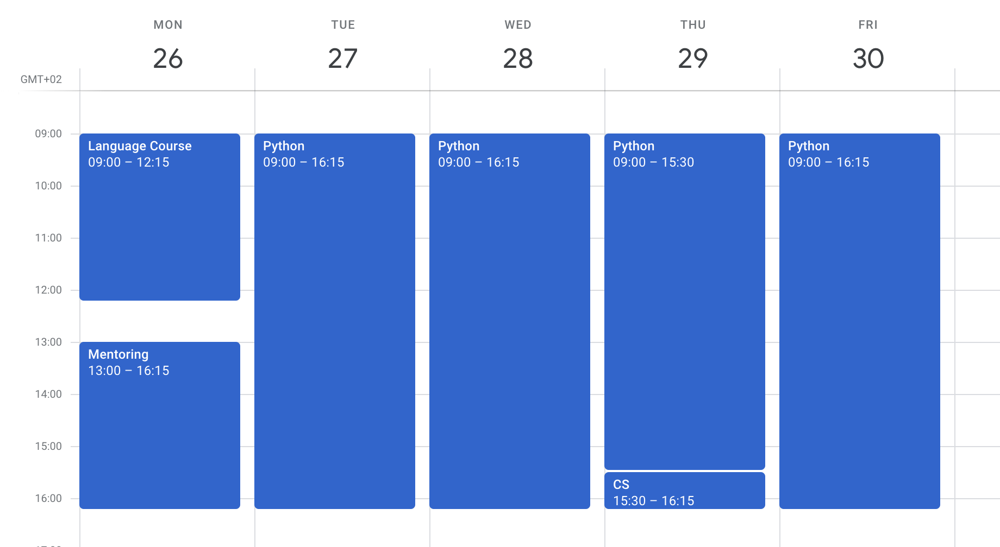 |

<h3 align="center">NES-ML Language</h3>

|                                                |  `CSS3`  `HTML5`  `JavaScript`  `NES.css` |
|:---------------------------------------------------------|:------------------------------------------:|
| Custom Markup Language designed specifically for coding workshops to allow creation of full website in one hour without prior coding knowledge    **Idea, Development, Deployment**  | 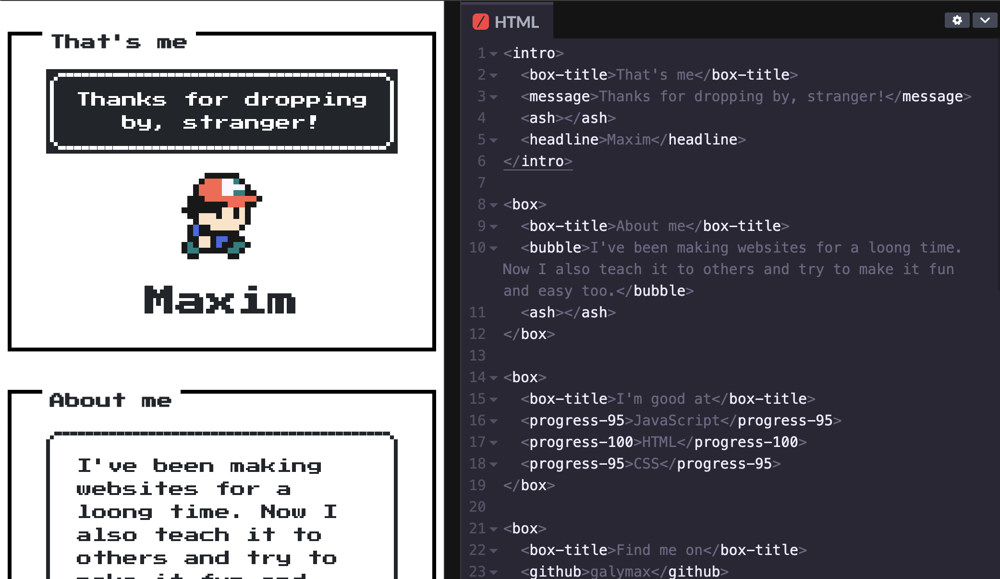 |

<h3 align="center">AI Test Generator</h3>

|                                                |  `OpenAI`  `Pinecone`  `Node.js`  `GitHub API`  `GitHub App` |
|:---------------------------------------------------------|:------------------------------------------:|
| GitHub App that generates automated tests, using the OpenAI API and retrieval from a vector database of existing tests    **Idea, Development, Deployment**  | 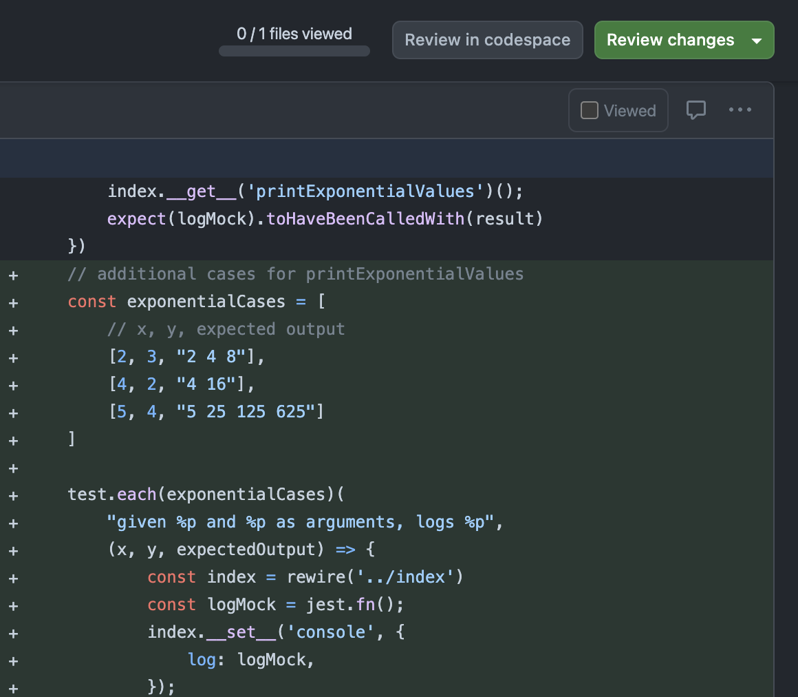 |

<h3 align="center">CodeBuddy</h3>

|                                                |  `Node.js`  `Jest`  `GitHub CI`  `GitHub Workflow`  `Puppeteer` |
|:---------------------------------------------------------|:------------------------------------------:|
| Automatic code reviews, grading, feedback, tracking    **Pitch, Team creation and leadership, Implementation**  |  |

<h3 align="center">Elbphilharmonie Ticket Shop and Mobile Site</h3>

|                                                |  `Node.js`  `Jest`  `GitHub CI`  `GitHub Workflow`  `Puppeteer` |
|:---------------------------------------------------------|:------------------------------------------:|
| Ticket Shop UI and Frontend functionality and Mobile Website UI    **Technical concept and development**  | 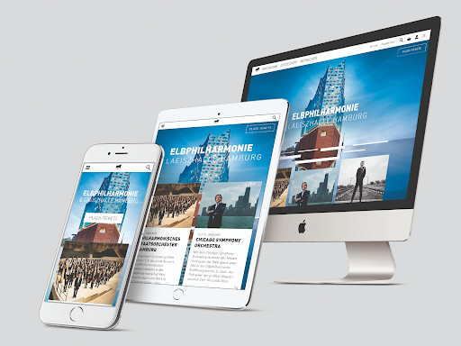 |

<h3 align="center">Lucerne Festival 3D Seat Booking</h3>

|                                                |  `Node.js`  `Jest`  `GitHub CI`  `GitHub Workflow`  `Puppeteer` |
|:---------------------------------------------------------|:------------------------------------------:|
| Development of interactive browser based 3D concert hall navigator as UI for ticket booking, including interactive 2D view for mobile devices. Running an interactive 3D model in the browser required a lot of work towards optimization of file formats, textures and algorithms    **Technical concept, 3D file format definition, UI and frontend functionality of 3D viewer, shopping cart and checkout**     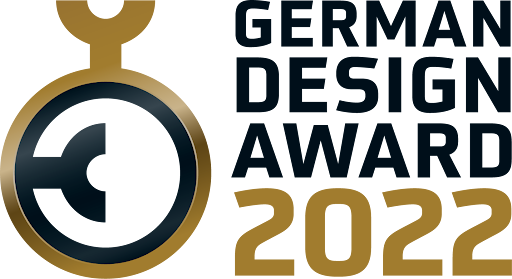&nbsp;&nbsp;&nbsp;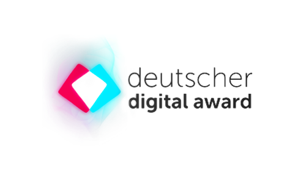&nbsp;&nbsp;&nbsp;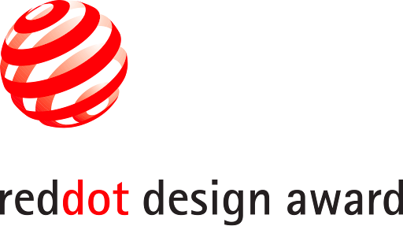 | 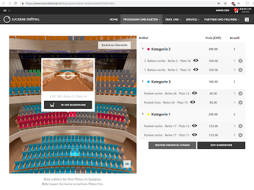 |

<h3 align="center">Kölner Philharomie Smart TV App</h3>

|                                                |  `Node.js`  `Jest`  `GitHub CI`  `GitHub Workflow`  `Puppeteer` |
|:---------------------------------------------------------|:------------------------------------------:|
| Automatic code reviews, grading, feedback, tracking    **Pitch, Team creation and leadership, Implementation**  | 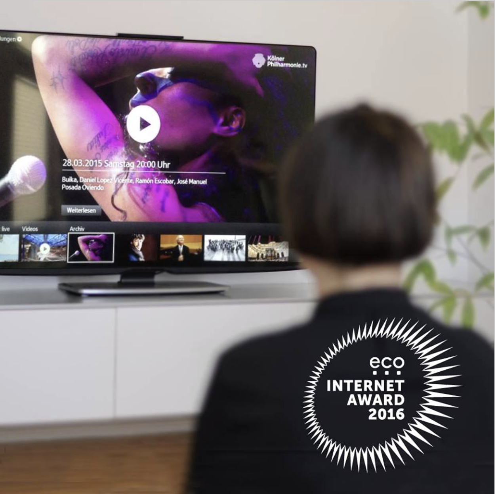 |

## Working Experience

### Senior Lead Developer Education Technology
  2022 - present  
  **DCI - Digital Career Institute GmbH**  
  - Lead development of a centralized Content Management System to standardize curriculum across courses, employing React, Go, and GitHub for storage and management, enabling easy access for non-technical users. 
  - Deployed OpenAI based company knowledge Slack bot using Pinecone and Node.js.
  - Deployed OpenAI based translation tool for curriculum materials
  - Initiated the development of an Automatic Test Generation application that leverages AI to mimic existing test styles, utilizing Node.js, OpenAI API, GitHub API and GitHub Apps.
  - Created a Calendar Generator tool to automate the production of course schedules and shift management, implemented with Node.js and integrated with GitHub Actions, Google Sheets API, Podio API, and Humanity API.
  - Lead development and deployed an AI-powered Student Support Bot on AWS, designed to answer student queries via a custom moodle plugin, crafted with Python, OpenAI API and Confluence API.
  - Engaged in various automation projects to streamline processes across teaching and administrative departments, utilizing tools such as make.com, GitHub Actions, Podio API, and Personio API.
  - Designed classes on AI, developed exercises, and conducted workshops with fellow educators to integrate AI concepts into the curriculum, fostering a tech-forward educational environment and enhancing teaching methodologies.

### Lecturer Full Stack Web Development
  2019 - present
  **DCI - Digital Career Institute GmbH**  
  - Designed and delivered comprehensive courses in Full Stack Web Development, specializing in the MERN stack (MongoDB, Express.js, React.js, Node.js), equipping students with modern development skills.
  - Created the NES Markup Language to lower the barrier to entry for absolute coding beginners.
  - eveloped curriculum and educational materials that covered fundamental and advanced concepts in web development including database management, server-side programming, client-side scripting, and front-end development.
  - Employed a variety of teaching methodologies to accommodate different learning styles, enhancing student engagement and comprehension.
  - Conducted daily practical live coding sessions to provide hands-on experience in building scalable and efficient web applications.
  - Assessed student progress through assignments, projects, and examinations, providing constructive feedback and personalized guidance to promote learning and improvement.
  - Fostered a collaborative classroom environment that encouraged innovation and problem-solving, preparing students for real-world challenges in web development.
  - Maintained strong professional relationships with students, offering mentorship and support in their academic and career endeavors.

### Product Owner Curriculum Automation
  2021 - 2022
  **DCI - Digital Career Institute GmbH**  
  Initiated the Autograding tool and coordinated a developer team to create and deploy a solution based on Automated tests and GitHub CI using Node.js, Jest and Puppeteer.

### Senior Web Developer
  2008 - 2018  
  **MIR MEDIA**  
  - Spearheaded the creation and deployment of sophisticated online presences and mobile applications, primarily focusing on the use of HTML5, CSS3, and JavaScript to build performance-optimized web interfaces suitable for mobile devices.
  - Played a crucial role in optimizing internal workflows, contributing significantly to the conception and implementation of development stacks, and developing template system architectures.
  - Established and maintained coding standards and workflow specifications, enhancing development processes and quality.
  - Developed custom tracking solutions and user analytics to provide actionable insights into user behavior, which supported strategic decision-making.
  - Led the development and publishing of hybrid apps for iOS, Android, and smart devices, ensuring high functionality and user engagement.
  - Demonstrated a profound commitment to quality, organizing and disciplining work processes that facilitated the rapid adoption of new technologies and problem-solving techniques.
  - Recognized for exceptional dedication and work ethic, consistently delivering high-quality results under pressure and earning commendations from superiors, colleagues, and clients for teamwork and professionalism.
  

### Web Developer
  2000 - 2008  
  **Freelance**  
  - Designed and developed engaging, responsive websites for a diverse client base, utilizing modern web technologies of the time including HTML, CSS, JavaScript, and early frameworks to deliver compelling user experiences.
  - Provided expert consultancy services in web design and development practices, helping clients optimize their online presence and achieve their digital objectives.
  - Managed full project cycles from concept through delivery, ensuring all web solutions were scalable, maintainable, and aligned with client needs.
  - Stayed ahead of digital trends and continuously updated technical skill sets to include emerging technologies, enhancing service offerings and client satisfaction.
  - Demonstrated a strong ability to work independently, solving complex problems efficiently and delivering projects within tight deadlines.
