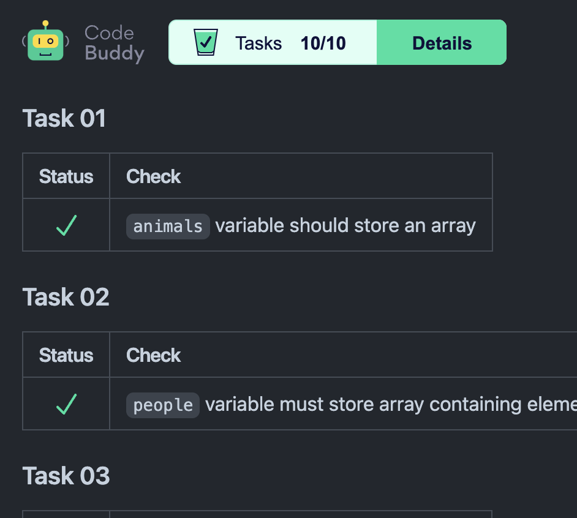

<h1 align="center">Maxim Werkhowski</h1>
Creative problem solver with 24 years of experince in software development and design.  

I'm driven to integrate all capabilities available today into software. My focus is value for the user. I'm able to design and operate applications within a very tight budget.  
  
Currently my focus is automation, including AI.

## Selected Projects

### AI Test Creation

<h3 align="center">CodeBuddy</h3>
|                                                |  `Node.js`  `Jest`  `GitHub CI`  `GitHub Workflow`  `Puppeteer` |
|:---------------------------------------------------------|:------------------------------------------:|
| Automatic code reviews, grading, feedback, tracking    **Pitch, Team creation and leadership, Implementation**  |  |

## Working Experience

### Senior Lead Developer Education Technology
  2022 - present  
  **DCI - Digital Career Institute GmbH**  
  Designing and developing software to facilitate learning and automate teaching tasks
  

### Senior Web Developer
  2008 - 2018  
  **MIR MEDIA**  
  Develop high performance Websites and Apps
  

### Web Developer
  2000 - 2008  
  **Freelance**  
  Consulting clients and building modern Web Applications
