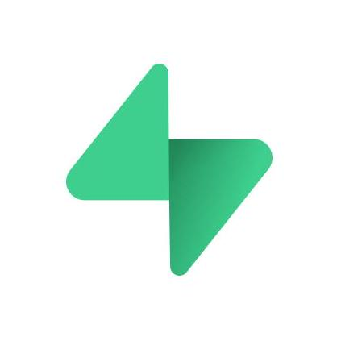

<h1 align="center">Maxim Werkhowski</h1>
Creative problem solver with 24 years of experience in software development and design.  
enior Web Developer at one of Germanys top 10 most creative digital  agencies for 10 years.  
4 years as Full-Stack WebDev Lecturer.  
Developed AI applications for translation, user management and conversational knowledge retrieval

I'm driven to integrate all capabilities available today into software. My focus is value for the user. I'm able to design and operate applications within a very tight budget.  
  
Currently my focus is automation, including AI.

## Selected Projects

<h3 align="center">Company Knowledge AI Chat Bot (RAG)</h3>

|                                                |  `OpenAI`  `Node.js`  `Pinecone` |
|:---------------------------------------------------------|:------------------------------------------:|
| AI powered conversational interface to the company knowledge base. Slack integration. Real-time synchronization with Confluence.    **Idea, Development, Deployment Pipeline**  |  |

<h3 align="center">Student Support AI Chat Bot (RAG)</h3>

|                                                |  `OpenAI`  `Azure`  `Python`  `AWS`  `Weaviate`  `moodle` |
|:---------------------------------------------------------|:------------------------------------------:|
| AI powered conversational interface to student support knowledge base. moodle integration. Real-time synchronization with Confluence.    **UI Design, Architectural Design, Project Lead**  |  |

<h3 align="center">RIMOWA Website</h3>

|                                                |   `CSS3`  `HTML5`  `JavaScript` |
|:---------------------------------------------------------|:------------------------------------------:|
| Product and Shop UI and Frontend functionality as well as custom dynamic video panorama teaser    **Technical concept, research, development**  |  |

<h3 align="center">Curriculum CMS</h3>

|                                                |  `Decap`  `Golang`  `git-gateway`  `gotrue`  `Google Oauth`  `Caddy` |
|:---------------------------------------------------------|:------------------------------------------:|
| Custom CMS for universal curriculum management    **Architectural Design, Project Lead**  |  |

<h3 align="center">AI-assisted onboarding</h3>

|                                                |  `OpenAI`  `Node.js`  `GitHub CI`  `make` |
|:---------------------------------------------------------|:------------------------------------------:|
| AI assisted fully automated student onboarding pipeline    **Idea, Development, Deployment**  |  |

<h3 align="center">AI translation and review</h3>

|                                                |  `OpenAI`  `Node.js`  `GitHub API`  `GitHub App` |
|:---------------------------------------------------------|:------------------------------------------:|
| GitHub app for AI powered fully automated translation and workflow management    **Idea, Development, Deployment**  |  |

<h3 align="center">Automated Course Planner</h3>

|                                                |  `CSS3`  `HTML5`  `JavaScript`  `NES.css` |
|:---------------------------------------------------------|:------------------------------------------:|
| Application for automatic full course schedule generation and publishing    **Idea, Development, Deployment**  |  |

<h3 align="center">NES-ML Language</h3>

|                                                |  `CSS3`  `HTML5`  `JavaScript`  `NES.css` |
|:---------------------------------------------------------|:------------------------------------------:|
| Custom Markup Language designed specifically for coding workshops to allow creation of full website in one hour without prior coding knowledge    **Idea, Development, Deployment**  |  |

<h3 align="center">AI Test Generator</h3>

|                                                |  `OpenAI`  `Pinecone`  `Node.js`  `GitHub API`  `GitHub App` |
|:---------------------------------------------------------|:------------------------------------------:|
| GitHub App that generates automated tests, using the OpenAI API and retrieval from a vector database of existing tests    **Idea, Development, Deployment**  |  |

<h3 align="center">CodeBuddy</h3>

|                                                |  `Node.js`  `Jest`  `GitHub CI`  `GitHub Workflow`  `Puppeteer` |
|:---------------------------------------------------------|:------------------------------------------:|
| Automatic code reviews, grading, feedback, tracking    **Pitch, Team creation and leadership, Implementation**  |  |

<h3 align="center">Elbphilharmonie Ticket Shop and Mobile Site</h3>

|                                                |  `Node.js`  `Jest`  `GitHub CI`  `GitHub Workflow`  `Puppeteer` |
|:---------------------------------------------------------|:------------------------------------------:|
| Ticket Shop UI and Frontend functionality and Mobile Website UI    **Technical concept and development**  |  |

<h3 align="center">Lucerne Festival 3D Seat Booking</h3>

|                                                |  `Node.js`  `Jest`  `GitHub CI`  `GitHub Workflow`  `Puppeteer` |
|:---------------------------------------------------------|:------------------------------------------:|
| Development of interactive browser based 3D concert hall navigator as UI for ticket booking, including interactive 2D view for mobile devices. Running an interactive 3D model in the browser required a lot of work towards optimization of file formats, textures and algorithms    **Technical concept, 3D file format definition, UI and frontend functionality of 3D viewer, shopping cart and checkout**     &nbsp;&nbsp;&nbsp;&nbsp;&nbsp;&nbsp; |  |

<h3 align="center">Kölner Philharomie Smart TV App</h3>

|                                                |  `Node.js`  `Jest`  `GitHub CI`  `GitHub Workflow`  `Puppeteer` |
|:---------------------------------------------------------|:------------------------------------------:|
| Automatic code reviews, grading, feedback, tracking    **Pitch, Team creation and leadership, Implementation**  |  |

## Working Experience

### Senior Lead Developer Education Technology
  2022 - present  
  **DCI - Digital Career Institute GmbH**  
  Designing and developing software to facilitate learning and automate teaching tasks
  

### Senior Web Developer
  2008 - 2018  
  **MIR MEDIA**  
  Develop high performance Websites and Apps
  

### Web Developer
  2000 - 2008  
  **Freelance**  
  Consulting clients and building modern Web Applications
